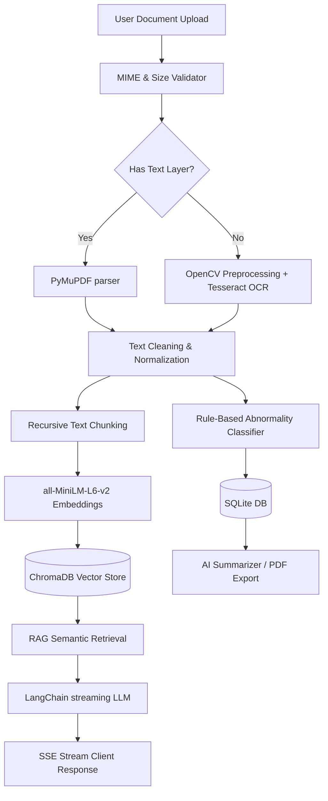

# MedRAG — AI-Powered Medical Report Analyzer

MedRAG is a production-grade, full-stack AI healthcare assistant designed to process, analyze, and query medical reports (including scanned PDFs, lab reports, and clinical images). The system features an automatic extraction and OCR pipeline, persistent vector database storage, AI narrative summarization, normal reference range abnormality detection, and a real-time conversational chat system.

---

## 🌟 Key Features

1. **Secure Document Ingestion**: Safe uploads supporting PDFs, PNG, JPG, TIFF, and WEBP formats up to 20MB, utilizing MIME checking and file-signature validators.
2. **Hybrid PDF Parsing & OCR**: High-speed text-layer parsing via PyMuPDF/pdfplumber, with a fallback to computer-vision-enhanced Tesseract OCR (with page rendering handled in-memory to eliminate external Poppler dependencies).
3. **Medical Token Abnormality Detector**: Structured extraction of clinical biomarker readings (e.g. Glucose, Cholesterol, BP, HbA1c) compared against clinical reference bounds to classify them (Normal, Borderline, Low, High, Critical) with patient-friendly clinical context.
4. **Persistent Vector Store & Semantic Retrieval**: Local ChromaDB instance using Hugging Face `all-MiniLM-L6-v2` embeddings for sub-second, multi-page context search.
5. **Streaming RAG Pipeline**: LangChain-powered conversational flow using GPT-4o, Claude 3.5 Sonnet fallback, and an **Offline Mock fallback** for local development without API keys.
6. **Premium Responsive Dashboard**: Split-pane, high-fidelity UI featuring glassmorphic accents, Recharts visualizer, raw text highlights search, voice recording/transcription, read-aloud TTS narration, and ReportLab PDF layout export.

---

## 🏗️ Architecture Flow



---

## 🚀 Quick Start (Local Setup)

### Prerequisites
- **Python 3.10+**
- **Node.js 20+**
- **Tesseract OCR Engine** (Required for OCR of scanned images. Download for Windows [here](https://github.com/UB-Mannheim/tesseract/wiki)). Ensure `tesseract.exe` is added to your system environment variables.

### 1. Setup Backend
1. Navigate to `backend/` and copy `.env.example` to `.env`:
   ```bash
   cp .env.example .env
   ```
2. Configure settings (or leave blank to trigger offline Mock mode):
   ```env
   OPENAI_API_KEY=your_openai_api_key_here
   ENCRYPTION_KEY= (Leave empty; backend will autogenerate a base64 key)
   ```
3. Initialize the Python virtual environment and install packages:
   ```powershell
   python -m venv venv
   .\venv\Scripts\activate
   pip install -r backend/requirements.txt
   ```
4. Launch the FastAPI server:
   ```bash
   uvicorn backend.main:app --reload --port 8000
   ```

### 2. Setup Frontend
1. Navigate to `frontend/`:
   ```bash
   npm install
   ```
2. Run Vite dev server:
   ```bash
   npm run dev
   ```
3. Access the portal at `http://localhost:5173`.

---

## 🐳 Running with Docker Compose

To spin up the entire production-grade stack including the persistent SQLite database, ChromaDB backend, and built Nginx frontend:

1. Copy `.env.example` to `.env` in the root directory.
2. Build and start the services:
   ```bash
   docker-compose up --build
   ```
3. Open `http://localhost:5173` to register/login and upload documents.

---

## 🧪 Testing

The backend includes a comprehensive unit testing suite using pytest to validate authentication flow, OCR/PDF extraction logic, abnormality classification ranges, and LLM chains.

Run tests using the virtual environment:
```bash
.\venv\Scripts\python.exe -m pytest backend/tests
```

---

## 🛡️ Privacy & HIPAA Considerations
- **Isolated Scoping**: All reports, vector stores, database entries, and chat sessions are strictly associated with a user's unique JWT identifier.
- **Data Encryption**: Document texts are symmetrically encrypted at rest using Fernet keys.
- **Poppler-free In-Memory Processing**: PDFs are rendered to images in RAM, preventing temporary files from caching on disk.
